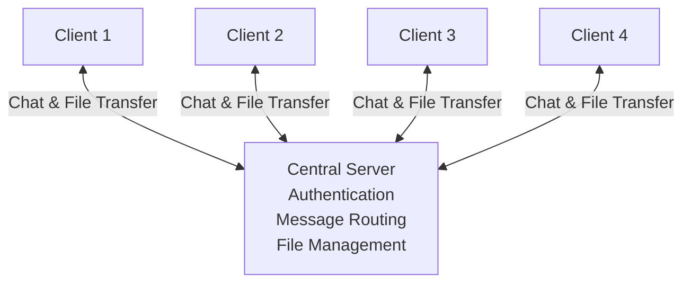
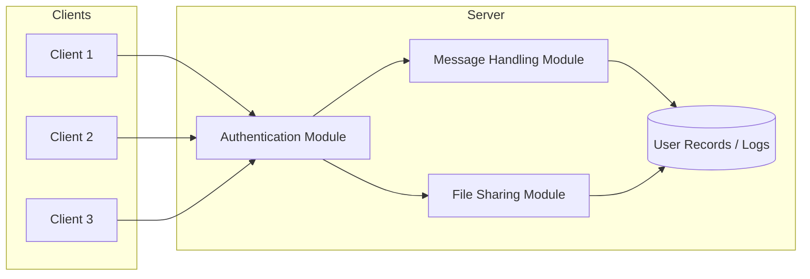
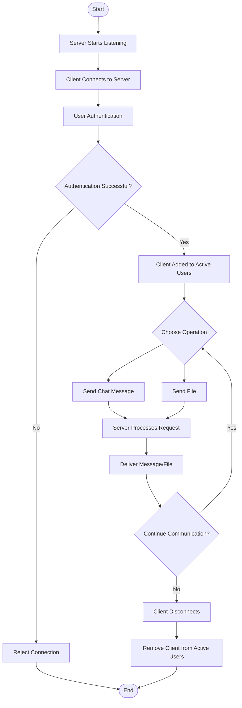
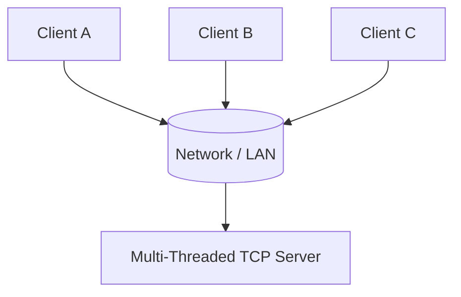

- 👋 Hi, I’m @Uzair-oozy
- 🌱 I’m currently learning C#
- 📫 How to reach me: oozy004@gmail.com

<!---
Uzair-oozy/Uzair-oozy is a ✨ special ✨ repository because its `README.md` (this file) appears on your GitHub profile.
You can click the Preview link to take a look at your changes.
--->
